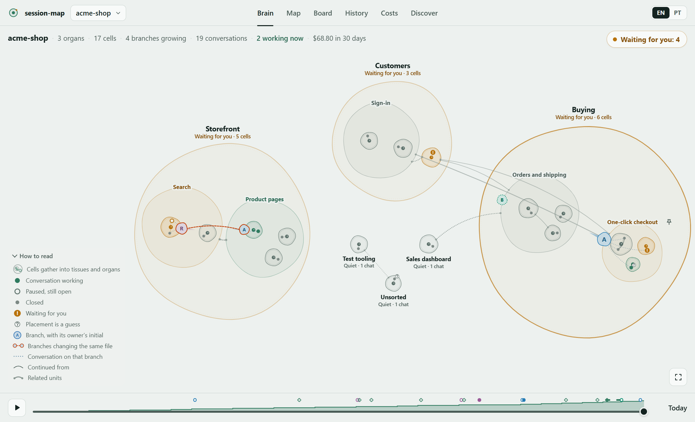
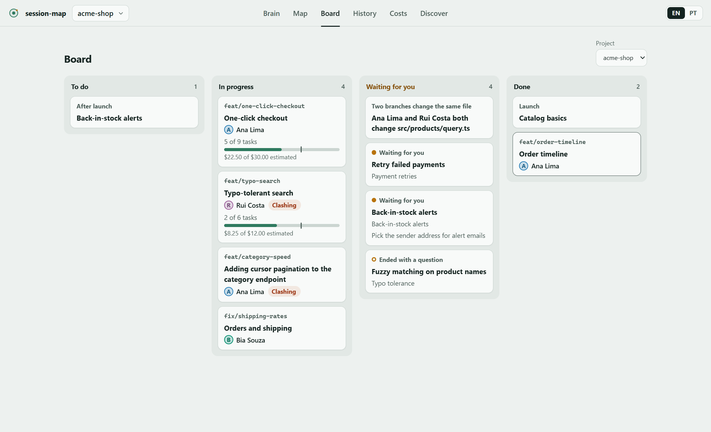

# session-map

[Português](README.pt-BR.md)

A Claude Code plugin that turns every conversation on your machine into a living brain in the browser. Each project is a body: **organs** and **tissues** group **cells** (areas of the work), each cell has a small **nucleus** (what is decided, what is left) and its **neurons** are your chats. Branches show up as work in progress, and a board, a cost view and a searchable history sit next to the brain.




The screenshots come from `--demo`, which uses invented data.

## Install

```text
/plugin marketplace add dan-abreu/session-map
/plugin install session-map@session-map
```

**Requirements:** Claude Code and Node.js 20 or newer on your `PATH`. The native Claude Code installer does not bring Node; without it the server, the hook that archives finished chats and the three commands do not run.

## Commands

| Command | What it does |
|---|---|
| `/session-map:map` | Starts the local server if it is not running and prints the links (this PC and your local network). `--local` skips the network link, `--port N` changes the port (default 4001). |
| `/session-map:board` | The current chat writes a short card about itself (area, branch, doing now, what is left, what waits for you) that the map reads. |
| `/session-map:history` | Searches the archived conversation history and answers with short matches. |
| `/session-map:architecture` | Teaches any chat the architecture map convention: where it lives, how to add an item, mark it in progress and close it, and how to create a map (asking first) for a project that has none. |

Without the plugin: `node server/main.mjs [--lan] [--port 4001]`, or `--demo` for sample data.

**Terminal only?** `node server/cli.mjs` (or `session-map` once the package is linked) prints the body as text: organs, tissues and cells with ● working / ○ quiet / ! waiting / ? not sorted, then the "Waiting for you" list and costs. It asks the running server and, if there is none, reads your history directly with the AI off. `--project <name>` narrows it, `--watch` redraws every 5 seconds, `--json` prints the state.

## Files

Open a unit or a branch and its **Files** section lists the files, new and changed ones marked. Tapping one opens it read-only (up to 1 MB, text only, never `.git`, never `.env` files) with the lines the branch changed highlighted. **Open in VS Code** opens that file on this PC, **Open terminal in this folder** opens a shell there, and **VS Code on your phone** appears when you set `tunnelUrl`. Reading files needs the token, like the chat.

## On your phone

`/session-map:map` prints a link with `?k=<token>`. Open it once and the browser keeps the token in a cookie. The token is in `~/.claude/session-map/token`; every write and every access from outside `127.0.0.1` needs it, so treat the network link like a password. The page listens on all interfaces only with `--lan`. Away from home, put both devices on [Tailscale](https://tailscale.com) and use the `100.x` link it prints. Do not expose the port to the internet.

## Chat from the page

For chats that run on this PC, turn on **Enable Remote Control for all sessions** in `/config`: the page then offers a button that continues that conversation from claude.ai or the Claude app. The page can also start and drive its own chats with your `claude` CLI.

**Conversations stay.** A conversation started on a unit is listed in that unit's chat sheet (the one used last first), and the brain shows it in that unit. Closing the sheet does not stop it; tapping it again shows its history and continues it (`claude --resume`), even after the server restarts. Reloading the page reopens the conversation that was open.

**Permissions.** A page chat runs in the permission mode of your own Claude Code: `permissions.defaultMode` from `~/.claude/settings.json`, then the project's `.claude/settings.json`, then `.claude/settings.local.json` (the more specific file wins, as in Claude Code). With nothing set, that is `default`, which asks before every tool that is not already allowed. The selector in the chat header changes it for that conversation only: **Same as Claude**, **Ask every time** (`default`), **Edits on their own** (`acceptEdits`) or **Automatic** (`auto`); the choice is kept per conversation and switches a running one from its next step. Whatever the mode still asks about appears in the sheet with **Allow** / **Deny** (no answer in 25 s denies it), and **Always in this conversation** is remembered for that conversation, also after a resume. `bypassPermissions` is never used: if your settings say so, the page runs the chat in `auto` and tells you.

> **Security:** a chat started from the page can edit files and run commands on this PC, like any Claude Code session, and in `acceptEdits` or `auto` it does part of that without asking you. Anyone holding your token can drive it, and pick its mode. Keep the token private and the page off the open internet.

## Costs are estimates

Costs are the API-price equivalent of the tokens in your local history. They are not your subscription bill.

## Internal formats may change

The plugin reads Claude Code's local files (sessions, transcripts, skills). Those formats are not a public contract and may change; everything that depends on them lives in `server/sources/claude.mjs`, so a break is a one-file fix.

## Privacy

The server reads `~/.claude` (or `CLAUDE_CONFIG_DIR`) and writes only to `~/.claude/session-map/`: token, config, archive, notes and logs. Data leaves your machine in two cases.

**AI organisation, on by default.** The map names and groups your work with your own `claude` CLI (`claude -p`, model `haiku`), so it goes to Anthropic like any Claude Code prompt. Each call sends a digest of one conversation, never the transcript: its title, up to 8 of your prompts cut to 160 characters, up to 30 file paths, up to 10 commit subjects, the branch name, and the names and purposes of the project's current units. To write the short memory of a unit that has no `/board` card ("where it stands", "decided", "to do"), a call sends the same digests (without file paths) of its 6 newest conversations, the last reply of each cut to 200 characters, and its branches' names, commit counts and last commit subjects, five units per call. The first time a project shows up, its 60 most recent conversations are read at once, outside the cap of 30 calls per hour; the page shows the estimated cost of this first organisation. Every call counts against your subscription limits or your API spend. To turn it off, put this in `~/.claude/session-map/config.json`:

```json
{ "ai": { "enabled": false } }
```

The map then groups chats by the files they touch and by the cards from `/session-map:board`.

**Discover tab.** It asks the GitHub API for public plugin repositories, and looks up the marketplaces you already added, only when you open the tab. If `GITHUB_TOKEN` is set, or `gh auth token` answers, that token goes to GitHub with these requests, for a wider search and a higher rate limit.

The network link (`--lan`) is plain HTTP: on a network you do not trust, use Tailscale or `--local`.

## Configuration

Machine-wide settings live in `~/.claude/session-map/config.json`. Every key is optional:

```json
{
  "ai": { "enabled": true, "model": "haiku", "maxCallsPerHour": 30, "bootstrapLimit": 60 },
  "budget": { "monthlyUSD": 100 },
  "currency": { "code": "BRL", "rate": 5.4 },
  "tunnelUrl": "https://vscode.dev/tunnel/my-pc",
  "projects": {
    "c:/dev/shop": { "roadmap": "docs/ROADMAP.md", "decisions": { "heading": "Decisions", "pendingWhen": "pending" }, "autoFetchMinutes": 15 }
  }
}
```

- `ai`: the AI organisation (see Privacy). `"ai": { "enabled": false }` turns it off.
- `budget.monthlyUSD`: shows how much of a monthly budget the estimated cost has used.
- `currency`: shows costs in another currency, at the rate you give (1 USD = `rate`).
- `tunnelUrl`: the link of your [VS Code Remote Tunnel](https://code.visualstudio.com/docs/remote/tunnels) (https only); it adds a **VS Code on your phone** button next to the files.
- `projects`: per-project settings, keyed by the project folder in lower case with `/`. The same keys can sit in `<project>/.claude/session-map.json`; the entry here wins.
  - `roadmap`: a Markdown file, relative to the project, whose `[x]`/`[ ]` (or ✅/⬜) lines become milestones. `decisions` reads the lines under the heading named `heading` that contain `pendingWhen` as decisions waiting for you.
  - `autoFetchMinutes`: runs `git fetch` that often so branches pushed from other machines show up. Off by default.
  - `ai`: `{ "enabled": false }` here turns the AI off for that project only.


## License

MIT. See [LICENSE](LICENSE).
