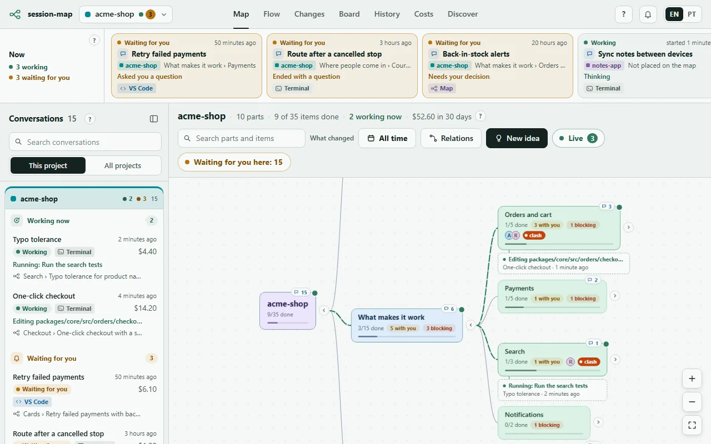
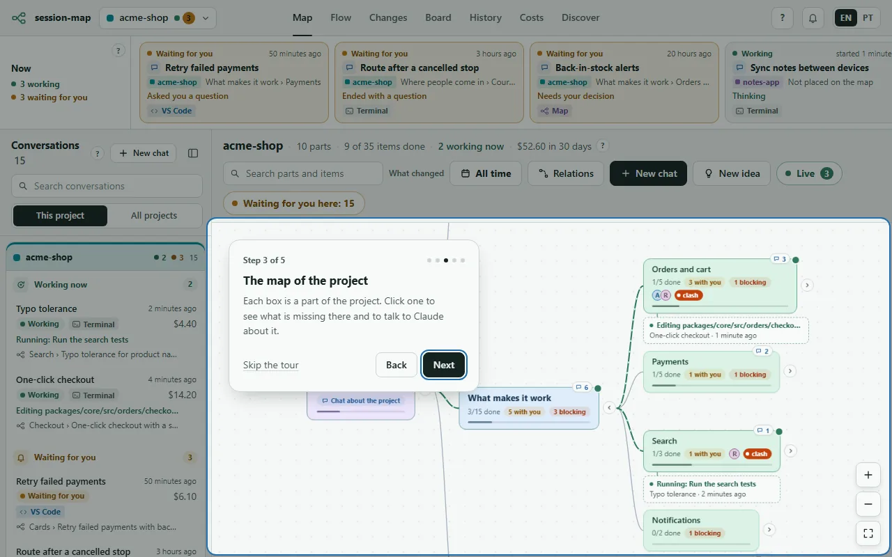
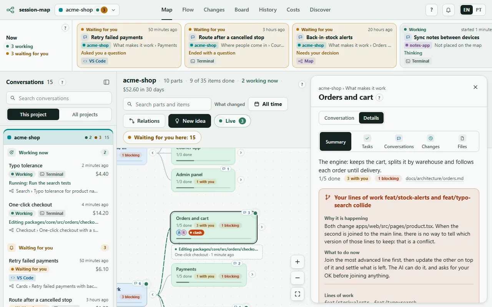
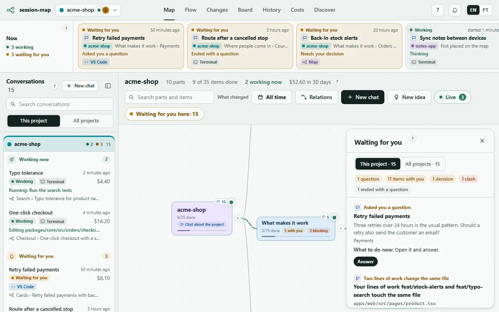
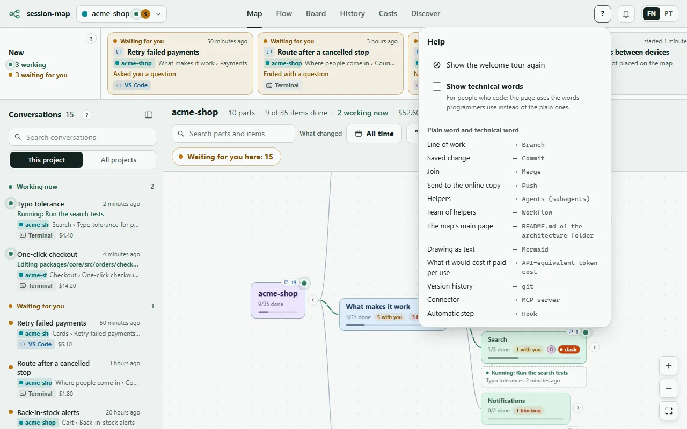
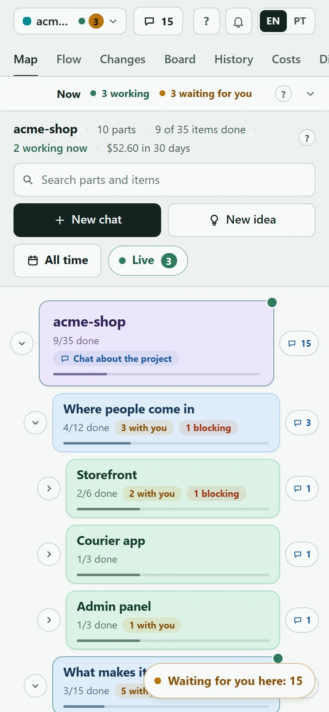

# session-map

[](https://github.com/dan-abreu/session-map/actions/workflows/test.yml)
[](https://github.com/dan-abreu/session-map/releases)
[](LICENSE)

[Português](README.pt-BR.md)

**See everything Claude is doing for you, on one page.** session-map is a free add-on for Claude Code. It draws your project as a map of boxes, puts every conversation with Claude on the box it works on, and tells you, in plain words, what is working now, what is done, what is waiting for you and what it would cost.

You do not need to know how to code to use it.



The pictures on this page come from a sample project with invented data (`--demo`).

## Start in 6 steps

**1. Install it.** In Claude Code, type these two lines, one at a time:

```text
/plugin marketplace add dan-abreu/session-map
/plugin install session-map@session-map
```

You also need Node.js 20 or newer on the computer ([nodejs.org](https://nodejs.org), the "LTS" button). Claude Code's own installer does not bring it.

**2. Open the map.** In Claude Code, type `/session-map:map`. It answers with a link: open it in your browser. Keep that link to yourself: it carries your key.

**3. Follow the welcome tour.** The first time, five short steps show the main places: what is happening now, your conversations, the map, what waits for you, and where to find help. You can skip it and play it again later from the **?** at the top.



**4. Click a box.** Each box is a part of your project. Its panel shows what is missing there, the conversations about it, the latest saved changes and its files, each in its own block with its own color. The **Conversation** tab lets you ask Claude for something about exactly that part.



If your project has no map yet, a banner offers to create one: Claude studies the project, proposes the parts in a chat and writes nothing until you say OK.

**5. Answer what waits for you.** The amber **Waiting for you** button lists the questions and decisions only you can answer. Each one says what it is, why it is happening and what to do now, with the button that does it.



**6. Ask the page.** Every area has a small **?** that says what it is in one sentence. The **?** at the top opens help: the tour again, a glossary, and **Show technical words** for people who prefer the programmers' terms (branch, commit, token…).



It works on a phone too: open the same link on the same Wi-Fi (or see [On your phone](#on-your-phone) below).



## Words on this page

| You see | Programmers say |
|---|---|
| Line of work | Branch |
| Saved change | Commit |
| Join | Merge |
| Helpers, team of helpers | Agents, workflow |
| The map's main page | README.md of the architecture folder |
| What it would cost if paid per use | API-equivalent token cost |

## For people who code

Everything below is the technical detail: how the map is stored, the tabs, the commands, security, privacy and settings.

Node.js 20 or newer must be on the `PATH`: without it the server, the hook that archives finished chats and the commands do not run.

### Architecture map

The map reads plain markdown, so it works with or without Claude, and your teammates can read it on GitHub. Where it looks: the folder set in the config `architecture`, else the first that exists of `docs/arquitetura`, `docs/architecture`, `docs/arch` (the working tree first, then the main branch, read from `origin/main` when the local `main` is behind it).

- `README.md` of the folder: the layers, as a mermaid `subgraph` block or as `##` headings listing the parts.
- One file per part: a title, an opening paragraph, "Where in the code" (paths in backticks, which hang chats and branches on the part), and **What's missing**, the checklist:

```markdown
### Sign in

- [ ] **in progress · Ana and Claude · step 2 of the roadmap:** Show the error under the field `lg07`
- [ ] **with Ana · blocks:** Pick the text of the reset e-mail `lg08`
- [x] **Claude:** Lock the account after 5 tries `lg06`
```

English and Portuguese section names both work. The `architecture` skill teaches this to every chat, VS Code included, so a new request becomes an item, starting marks it in progress, and finishing ticks it. See [docs/architecture](docs/architecture/README.md) for this repository mapped the same way.

### Flow tab

The **Flow** tab draws the folder README's mermaid diagram with a pinned copy of mermaid shipped with the plugin (no CDN, strict security level). Each box that is a part takes the color of its situation (a chat working there, in progress, still to do, all done), with marks for blockers and items waiting on a person, and a click opens that part's chat beside the drawing. When the README has no arrows of its own, the relations session-map found fill in as dotted arrows.

- **Export:** Copy, or save the drawing as an SVG or PNG image, as a Markdown page with the drawing inside, or as `.mmd` text.
- **Import:** paste a drawing or pick a file, see what it changes (new parts and the file each gets, layers, moves, parts left out, arrows), then confirm. Only the README's mermaid block and a skeleton file per new part are written; nothing is deleted, and each apply goes to `actions.log`. A map read from the main branch can be previewed but not applied.
- **Workshop:** a shared draft per project. A side chat redraws it with every reply, and the tools add boxes, arrows and layers, rename, move and remove, with a text editor and undo/redo. Nothing reaches the project until you apply it through the import preview.

### Conversation list

The column on the left of the map lists every conversation of the open project from the last 31 days, wherever it ran: started on the map, in VS Code, in a terminal, or by an automation. It folds to a narrow rail; on a phone, the **Conversations** button at the top opens it as a drawer.

- Groups: **Working now** (with the latest step), **Waiting for you**, then **Recent** (50 at a time, **Show more** for the rest).
- Each row: the title, where it sits on the map (layer › part › item, or **New idea**, **Creating the architecture map**, **Flow workshop**, **Not placed on the map**), how long ago, its cost and where it ran.
- Search by title or place, and switch between **This project** and **All projects**.
- A click opens the branches down to its box, centers it with a short pulse, and opens the conversation beside the map. A map conversation picks up where it stopped (`claude --resume`); one from VS Code or a terminal shows its history, with **Open in VS Code** or **Open in a terminal**, and can go on from the page once it is closed there.
- Every box of the map shows how many conversations it and its children hold; a click on that number narrows the list to that box.

### Live

The **Live** button on the map counts the conversations working now, in every project, and opens **Working now**: one card per conversation, grouped by project, with its way down the map, its latest steps (the newest first), its workflows with done/total and the helper agents still running with their model, and **Show on map** / **Open conversation**. It updates every 5 seconds. On the map itself the way from the project to the box being worked on lights up in green, and a caption under that box names the latest step. A workflow agent that has not moved for 30 minutes is left out, so an interrupted run does not stay "working" for ever.

### Changes tab

The **Changes** tab lists, as it happens, every file your conversations and their helpers created, edited, removed or renamed, in this project or in all of them. Filter by part, by who did it (a conversation, a helper of a team, or outside the conversations) and by kind, or pick a day. Each change says whether it is not saved yet, saved or released, and a click shows its before and after, what you asked that led to it, and **Open the file** / **Open the conversation**. Files that hold passwords or keys never show their content.

### Commands

| Command | What it does |
|---|---|
| `/session-map:map` | Starts the local server if it is not running and prints the links (this PC and your local network). `--local` skips the network link, `--port N` changes the port (default 4001). |
| `/session-map:board` | The current chat writes a short card about itself (area, branch, doing now, what is left, what waits for you) that the map reads. |
| `/session-map:history` | Searches the archived conversation history and answers with short matches. |
| `/session-map:architecture` | Teaches any chat the architecture map convention: where it lives, how to add an item, mark it in progress and close it, and how to create a map (asking first) for a project that has none. |

Without the plugin: `node server/main.mjs [--lan] [--port 4001]`, or `--demo` for sample data.

**Terminal only?** `node server/cli.mjs` (or `session-map` once the package is linked) prints the map as text: layers and parts with ● working / ○ quiet / ! waiting / ✓ all done, then the "Waiting for you" list and costs. It asks the running server and, if there is none, reads your history directly with the AI off. `--project <name>` narrows it, `--watch` redraws every 5 seconds, `--json` prints the state.

### Files

Open a part, an item or a branch and its **Files** section lists the files, new and changed ones marked. Tapping one opens it read-only (up to 1 MB, text only, never `.git`, never `.env` files) with the lines the branch changed highlighted. **Open in VS Code** opens that file on this PC, **Open terminal in this folder** opens a shell there, and **VS Code on your phone** appears when you set `tunnelUrl`. Reading files needs the token, like the chat.

### On your phone

`/session-map:map` prints a link with `?k=<token>`. Open it once and the browser keeps the token in a cookie. The token is in `~/.claude/session-map/token`; every write and every access from outside `127.0.0.1` needs it, so treat the network link like a password. The page listens on all interfaces only with `--lan`. Away from home, put both devices on [Tailscale](https://tailscale.com) and use the `100.x` link it prints. Do not expose the port to the internet.

### Chat from the page

For chats that run on this PC, turn on **Enable Remote Control for all sessions** in `/config`: the page then offers a button that continues that conversation from claude.ai or the Claude app. The page can also start and drive its own chats with your `claude` CLI.

**Conversations stay.** A conversation started on a box of the map is listed in that box's chat (the one used last first), and the map shows it on that part. Closing the sheet does not stop it; tapping it again shows its history and continues it (`claude --resume`), even after the server restarts. Reloading the page reopens the conversation that was open.

**How it runs.** The line at the top of the chat shows the way the conversation runs, the model and effort Claude reported, what it has cost so far and why it works that way; a click opens the choices.

- **Automatic** (the default for a new conversation): Opus at high effort sizes each request, following the sizing rule of your CLAUDE.md when it has one. A small request it answers directly; a medium one it hands to helper agents, each with an explicit model and effort; a large or sensitive one (a new system, sign-in, personal data, money, production, deleting things, a push) needs the reinforced way, a planned workflow with cross-checks that costs several times more. Before reinforcing it explains why in plain words, gives an estimate and waits for **Yes, reinforce** or **No, do it the normal way**; until you answer, the conversation is listed under **Waiting for you**. **May reinforce on its own** lets it go ahead while the month's reinforced spend plus the estimate fits the limit you set (`budget.reinforcedMonthlyUSD`); past it, it asks again.
- **Manual:** **Maestro** (Opus at high hands the parts to helpers without asking), **Ultracode** (`--effort ultracode`, with a cost warning to confirm), **Fixed model** (Haiku, Sonnet or Opus at low, medium, high, extra high or max) and **Same as my Claude** (no flags: the model and effort your own settings give, read as Claude Code reads them).

Changing the way, the model or the effort restarts the conversation's `claude` process; the next message resumes it with the new flags. Conversations started in VS Code or a terminal stay on **Same as my Claude** until you pick something else.

**Permissions.** A page chat runs in the permission mode of your own Claude Code: `permissions.defaultMode` from `~/.claude/settings.json`, then the project's `.claude/settings.json`, then `.claude/settings.local.json` (the more specific file wins, as in Claude Code). With nothing set, that is `default`, which asks before every tool that is not already allowed. The selector in the chat header changes it for that conversation only: **Same as Claude**, **Ask every time** (`default`), **Edits on their own** (`acceptEdits`) or **Automatic** (`auto`); the choice is kept per conversation and switches a running one from its next step. Whatever the mode still asks about appears in the sheet with **Allow** / **Deny** (no answer in 25 s denies it), and **Always in this conversation** is remembered for that conversation, also after a resume. `bypassPermissions` is never used: if your settings say so, the page runs the chat in `auto` and tells you.

**Every Claude on this PC.** Next to the selector, **Use on this whole PC** makes the chosen mode the default of your own Claude Code. After you confirm it, the server writes `permissions.defaultMode` (`default`, `acceptEdits` or `auto`, never `bypassPermissions`) into `~/.claude/settings.json` and leaves the other keys alone. VS Code and the terminal read that file too, so the mode applies to every new conversation on this PC. Before the first change a copy of the file goes to `settings.json.session-map-bak` next to it, and **Undo the last change** puts back the value from before.

> **Security:** a chat started from the page can edit files and run commands on this PC, like any Claude Code session, and in `acceptEdits` or `auto` it does part of that without asking you. Anyone holding your token can drive it, pick its mode, and switch the mode of every Claude on this PC to `auto`. Keep the token private and the page off the open internet.

### Costs are estimates

Costs are the API-price equivalent of the tokens in your local history. They are not your subscription bill.

### Internal formats may change

The plugin reads Claude Code's local files (sessions, transcripts, skills). Those formats are not a public contract and may change; everything that depends on them lives in `server/sources/claude.mjs`, so a break is a one-file fix.

### Privacy

The server reads `~/.claude` (or `CLAUDE_CONFIG_DIR`) and writes to `~/.claude/session-map/` (token, config, archive, notes, logs and, for the Changes tab, a masked copy of each changed file not saved yet, kept for 30 days so a removed file still shows what it had) and, only when you confirm it on the page, `permissions.defaultMode` in `~/.claude/settings.json`. The architecture folder of a project is written by the chats, through your `claude` CLI and in your permission mode, not by the server. Data leaves your machine in two cases.

**AI organisation, on by default.** The map places the conversations the code could not place with your own `claude` CLI (`claude -p`, model `haiku`), so it goes to Anthropic like any Claude Code prompt. Only conversations that no item code and no edited file could place are shown to the AI, once each. A call sends a digest of one conversation, never the transcript: its title, up to 8 of your prompts cut to 160 characters, up to 30 file paths, up to 10 commit subjects, the branch name, and the name, layer, purpose and folders of each part of the project's architecture. At most 30 calls per hour. Every call counts against your subscription limits or your API spend. To turn it off, put this in `~/.claude/session-map/config.json`:

```json
{ "ai": { "enabled": false } }
```

The map then places chats by the item codes they cite, by the files they touch and by the cards from `/session-map:board`.

**Discover tab.** It asks the GitHub API for public plugin repositories, and looks up the marketplaces you already added, only when you open the tab. If `GITHUB_TOKEN` is set, or `gh auth token` answers, that token goes to GitHub with these requests, for a wider search and a higher rate limit.

The network link (`--lan`) is plain HTTP: on a network you do not trust, use Tailscale or `--local`.

### Configuration

Machine-wide settings live in `~/.claude/session-map/config.json`. Every key is optional:

```json
{
  "ai": { "enabled": true, "model": "haiku", "maxCallsPerHour": 30 },
  "budget": { "monthlyUSD": 100 },
  "currency": { "code": "BRL", "rate": 5.4 },
  "tunnelUrl": "https://vscode.dev/tunnel/my-pc",
  "projects": {
    "c:/dev/shop": { "roadmap": "docs/ROADMAP.md", "decisions": { "heading": "Decisions", "pendingWhen": "pending" }, "autoFetchMinutes": 15 }
  }
}
```

- `ai`: the AI organisation (see Privacy). `"ai": { "enabled": false }` turns it off.
- `budget.monthlyUSD`: shows how much of a monthly budget the estimated cost has used.
- `budget.reinforcedMonthlyUSD`: the monthly limit for **May reinforce on its own** in Automatic chats; it can also be set from the chat.
- `currency`: shows costs in another currency, at the rate you give (1 USD = `rate`).
- `tunnelUrl`: the link of your [VS Code Remote Tunnel](https://code.visualstudio.com/docs/remote/tunnels) (https only); it adds a **VS Code on your phone** button next to the files.
- `projects`: per-project settings, keyed by the project folder in lower case with `/`. The same keys can sit in `<project>/.claude/session-map.json`; the entry here wins.
  - `roadmap`: a Markdown file, relative to the project, whose `[x]`/`[ ]` (or ✅/⬜) lines become milestones. `decisions` reads the lines under the heading named `heading` that contain `pendingWhen` as decisions waiting for you.
  - `autoFetchMinutes`: runs `git fetch` that often so branches pushed from other machines show up. Off by default.
  - `ai`: `{ "enabled": false }` here turns the AI off for that project only.


## Contributing

Issues and pull requests are welcome: see [CONTRIBUTING.md](CONTRIBUTING.md). To report a vulnerability, see [SECURITY.md](SECURITY.md).

## License

MIT. See [LICENSE](LICENSE).
