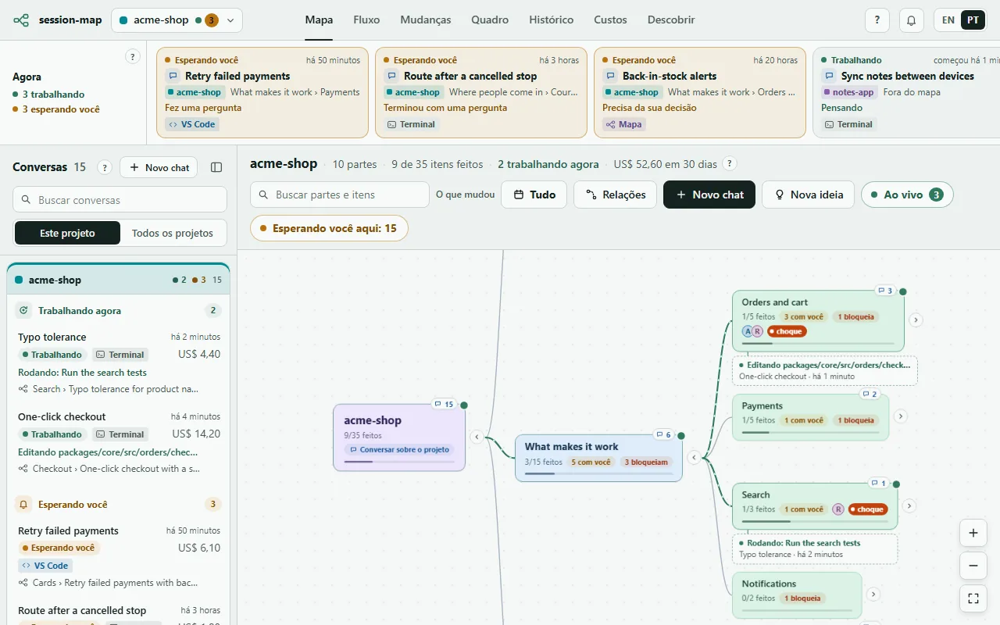
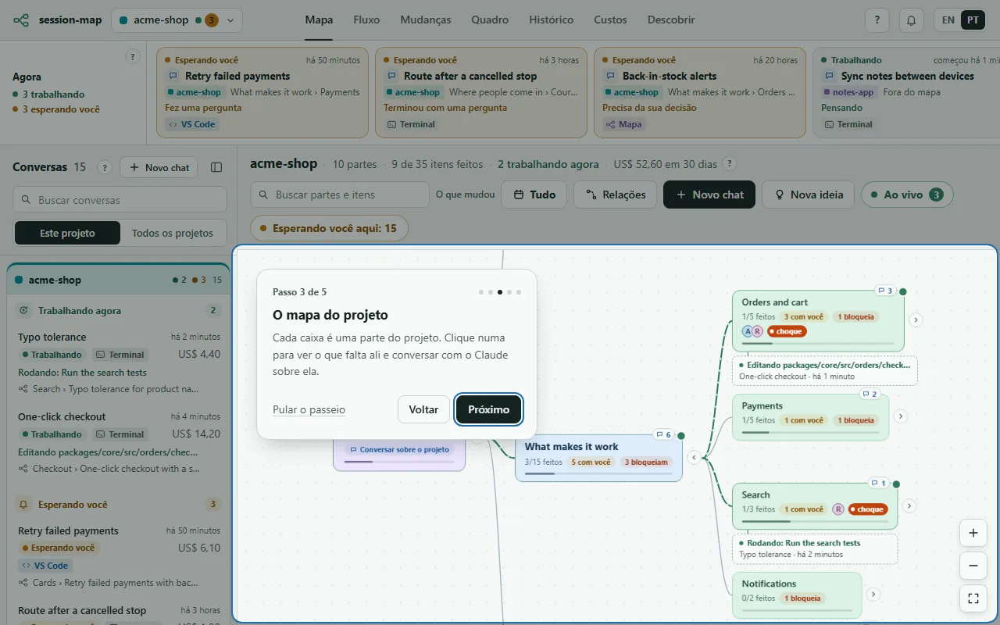
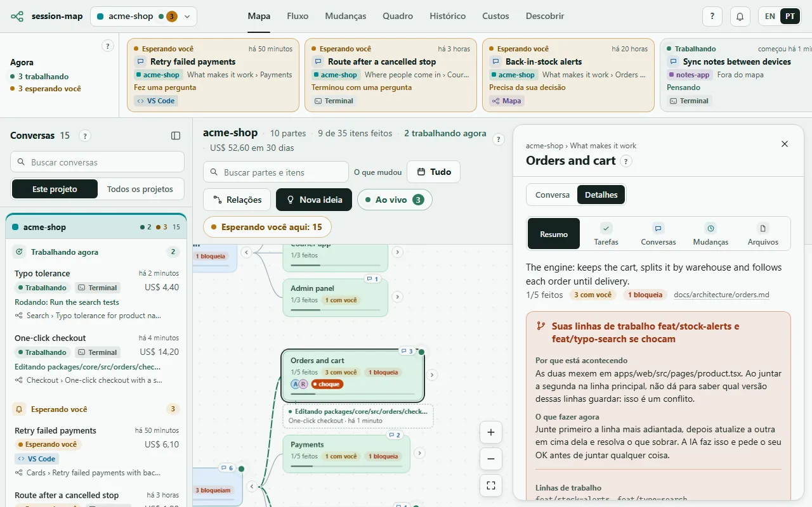
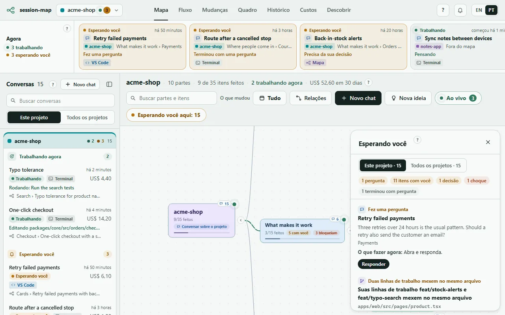
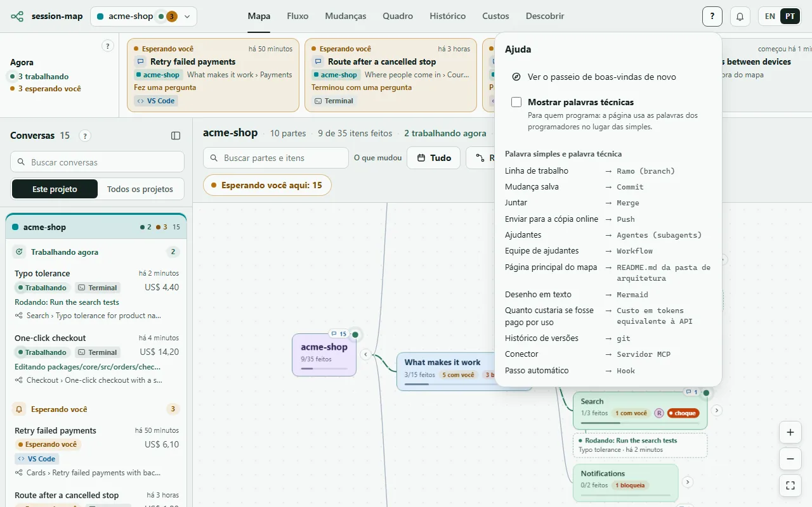
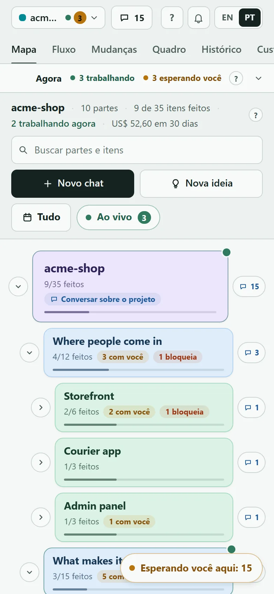

# session-map

[](https://github.com/dan-abreu/session-map/actions/workflows/test.yml)
[](https://github.com/dan-abreu/session-map/releases)
[](LICENSE)

[English](README.md)

**Veja numa página só tudo o que o Claude está fazendo por você.** O session-map é um complemento gratuito do Claude Code. Ele desenha o seu projeto como um mapa de caixas, põe cada conversa com o Claude na caixa em que ela trabalha e mostra, em palavras simples, o que está trabalhando agora, o que ficou pronto, o que espera por você e quanto custaria.

Não precisa saber programar para usar.



As imagens desta página vêm de um projeto de exemplo com dados inventados (`--demo`); os nomes das partes ficam em inglês porque o exemplo é em inglês.

## Comece em 6 passos

**1. Instale.** No Claude Code, digite estas duas linhas, uma de cada vez:

```text
/plugin marketplace add dan-abreu/session-map
/plugin install session-map@session-map
```

Também é preciso ter o Node.js 20 ou mais novo no computador ([nodejs.org](https://nodejs.org), botão "LTS"). O instalador do próprio Claude Code não traz o Node.

**2. Abra o mapa.** No Claude Code, digite `/session-map:map`. Ele responde com um link: abra no navegador. Guarde esse link só para você: ele leva a sua chave.

**3. Siga o passeio de boas-vindas.** Na primeira vez, cinco passos curtos mostram os lugares principais: o que está acontecendo agora, as suas conversas, o mapa, o que espera por você e onde achar ajuda. Dá para pular e ver de novo depois pelo **?** lá no alto.



**4. Clique numa caixa.** Cada caixa é uma parte do seu projeto. O painel dela mostra o que falta ali, as conversas sobre ela, as últimas mudanças salvas e os arquivos, cada coisa no seu bloco e com a sua cor. A aba **Conversa** deixa você pedir algo ao Claude exatamente sobre aquela parte.



Se o projeto ainda não tem mapa, uma faixa oferece criar um: o Claude estuda o projeto, propõe as partes numa conversa e não escreve nada até você dizer OK.

**5. Responda o que espera por você.** O botão âmbar **Esperando você** lista as perguntas e decisões que só você pode responder. Cada uma diz o que é, por que está acontecendo e o que fazer agora, com o botão que faz.



**6. Pergunte à página.** Cada área tem um **?** pequeno que diz o que ela é numa frase. O **?** lá no alto abre a ajuda: o passeio de novo, um glossário e **Mostrar palavras técnicas**, para quem prefere os termos dos programadores (branch, commit, token…).



Funciona no celular também: abra o mesmo link no mesmo Wi-Fi (ou veja [No celular](#no-celular) mais abaixo).



## Palavras desta página

| Você vê | Os programadores dizem |
|---|---|
| Linha de trabalho | Ramo (branch) |
| Mudança salva | Commit |
| Juntar | Merge |
| Ajudantes, equipe de ajudantes | Agentes, workflow |
| Página principal do mapa | README.md da pasta de arquitetura |
| Quanto custaria se fosse pago por uso | Custo em tokens equivalente à API |

## Para quem programa

Tudo daqui para baixo é o detalhe técnico: como o mapa é guardado, as abas, os comandos, segurança, privacidade e configurações.

O Node.js 20 ou mais novo precisa estar no `PATH`: sem ele, o servidor, o hook que arquiva as conversas encerradas e os comandos não rodam.

### Mapa de arquitetura

O mapa lê markdown puro, então funciona com ou sem o Claude, e o seu time lê no GitHub. Onde ele procura: a pasta da configuração `architecture`, senão a primeira que existir entre `docs/arquitetura`, `docs/architecture`, `docs/arch` (primeiro a árvore de trabalho, depois o ramo principal, lido do `origin/main` quando o `main` local está atrás dele).

- `README.md` da pasta: as camadas, num bloco mermaid com `subgraph` ou em títulos `##` que listam as partes.
- Um arquivo por parte: título, parágrafo de abertura, "Onde está no código" (caminhos entre crases, que penduram conversas e ramos na parte) e **O que falta**, a lista de tarefas:

```markdown
### Entrar

- [ ] **em andamento · Ana e Claude · etapa 2 do roteiro:** Mostrar o erro embaixo do campo `lg07`
- [ ] **com a Ana · bloqueia:** Escolher o texto do e-mail de recuperação `lg08`
- [x] **Claude:** Travar a conta depois de 5 tentativas `lg06`
```

Os nomes de seção em português e em inglês funcionam. A skill `architecture` ensina isso a toda conversa, inclusive no VS Code: pedido novo vira item, começar marca em andamento e terminar marca como feito. Veja [docs/architecture](docs/architecture/README.md) com este repositório mapeado do mesmo jeito.

### Aba Fluxo

A aba **Fluxo** desenha o diagrama mermaid do README da pasta com uma cópia fixa do mermaid que vem no plugin (sem CDN, nível de segurança estrito). Cada caixa que é uma parte ganha a cor da situação dela (conversa trabalhando ali, em andamento, falta fazer, tudo feito), com marcas para o que trava algo e o que espera uma pessoa, e um clique abre o chat da parte ao lado do desenho. Quando o README não tem setas próprias, as relações que o session-map encontrou entram como setas tracejadas.

- **Exportar:** Copiar, ou salvar o desenho como imagem SVG ou PNG, como página Markdown com o desenho dentro, ou como texto `.mmd`.
- **Importar:** cole um desenho ou escolha um arquivo, veja o que muda (partes novas e o arquivo de cada uma, camadas, mudanças de camada, partes fora do desenho, setas) e confirme. Só o bloco mermaid do README e um arquivo-esqueleto por parte nova são gravados; nada é apagado, e cada aplicação vai para o `actions.log`. Um mapa lido do ramo principal mostra a prévia, mas não aplica.
- **Ateliê:** um rascunho compartilhado por projeto. Um chat ao lado redesenha a cada resposta, e as ferramentas criam caixas, setas e camadas, renomeiam, movem e tiram, com editor de texto e desfazer/refazer. Nada chega ao projeto até você aplicar pela prévia da importação.

### Lista de conversas

A coluna à esquerda do mapa lista toda conversa do projeto aberto dos últimos 31 dias, onde quer que ela tenha rodado: iniciada no mapa, no VS Code, num terminal ou por uma automação. Ela recolhe para um trilho estreito; no celular, o botão **Conversas** no topo abre a lista como gaveta.

- Grupos: **Trabalhando agora** (com o último passo), **Esperando você** e depois **Recentes** (50 por vez, **Mostrar mais** para o resto).
- Cada linha: o título, onde ela fica no mapa (camada › parte › item, ou **Nova ideia**, **Criando o mapa de arquitetura**, **Ateliê do fluxo**, **Fora do mapa**), há quanto tempo, o custo e onde ela rodou.
- Busca por título ou lugar, e troca entre **Este projeto** e **Todos os projetos**.
- Um clique abre os galhos até a caixa dela, centraliza a caixa com um pulso curto e abre a conversa ao lado do mapa. Uma conversa do mapa continua de onde parou (`claude --resume`); uma do VS Code ou do terminal mostra o histórico, com **Abrir no VS Code** ou **Abrir num terminal**, e pode continuar pela página depois de fechada lá.
- Cada caixa do mapa mostra quantas conversas ela e as de baixo têm; um clique nesse número filtra a lista para aquela caixa.

### Ao vivo

O botão **Ao vivo** do mapa conta as conversas trabalhando agora, em todos os projetos, e abre **Trabalhando agora**: um cartão por conversa, agrupado por projeto, com o caminho dela no mapa, os últimos passos (o mais novo primeiro), os workflows com feitos/total e os agentes ajudantes ainda trabalhando com o modelo de cada um, e **Mostrar no mapa** / **Abrir conversa**. Ele se atualiza a cada 5 segundos. No próprio mapa, o caminho do projeto até a caixa em que se trabalha acende em verde, e uma legenda embaixo dessa caixa diz o último passo. Um agente de workflow parado há 30 minutos sai da lista, para um trabalho interrompido não ficar "trabalhando" para sempre.

### Aba Mudanças

A aba **Mudanças** lista, na hora, cada arquivo que as suas conversas e os ajudantes delas criaram, editaram, apagaram ou renomearam, neste projeto ou em todos. Filtre por parte, por quem fez (uma conversa, um ajudante de uma equipe ou fora das conversas) e por tipo, ou escolha um dia. Cada mudança diz se ainda não foi salva, se foi salva ou publicada, e um clique mostra o antes e o depois, o que você pediu e levou a ela, e **Abrir o arquivo** / **Abrir a conversa**. Arquivos que guardam senhas ou chaves nunca mostram o conteúdo.

### Comandos

| Comando | O que faz |
|---|---|
| `/session-map:map` | Liga o servidor local se não estiver no ar e mostra os links (este PC e a rede local). `--local` tira o link de rede, `--port N` troca a porta (padrão 4001). |
| `/session-map:board` | A conversa atual escreve um cartão curto sobre si (área, ramo, fazendo agora, o que falta, o que espera por você) que o mapa lê. |
| `/session-map:history` | Busca no histórico arquivado e responde com resultados curtos. |
| `/session-map:architecture` | Ensina a qualquer conversa a convenção do mapa de arquitetura: onde fica, como abrir um item, marcar em andamento e fechar, e como criar o mapa (pedindo antes) num projeto que não tem. |

Sem o plugin: `node server/main.mjs [--lan] [--port 4001]`, ou `--demo` para dados de exemplo.

**Só terminal?** `node server/cli.mjs` (ou `session-map` com o pacote ligado) mostra o mapa em texto: camadas e partes com ● trabalhando / ○ quieto / ! esperando / ✓ tudo feito, depois a lista "Esperando você" e os custos. Ele pergunta ao servidor que estiver rodando e, se não houver, lê o seu histórico direto, com a IA desligada. `--project <nome>` filtra, `--watch` redesenha a cada 5 segundos, `--json` imprime o estado.

### Arquivos

Abra uma parte, um item ou um ramo e a seção **Arquivos** lista os arquivos, com os novos e alterados marcados. Tocar num deles abre só para leitura (até 1 MB, só texto, nunca `.git`, nunca arquivos `.env`) com as linhas que o ramo mudou em destaque. **Abrir no VS Code** abre o arquivo neste PC, **Abrir terminal nesta pasta** abre um terminal ali, e **VS Code no celular** aparece quando você define `tunnelUrl`. Ler arquivos exige o token, como o chat.

### No celular

`/session-map:map` mostra um link com `?k=<token>`. Abra uma vez e o navegador guarda o token num cookie. O token fica em `~/.claude/session-map/token`; toda escrita e todo acesso de fora do `127.0.0.1` exige o token, então trate o link de rede como uma senha. A página só escuta em todas as interfaces com `--lan`. Fora de casa, ponha os dois aparelhos no [Tailscale](https://tailscale.com) e use o link `100.x` que ele mostra. Não exponha a porta na internet.

### Conversar pela página

Para conversas que rodam neste PC, ligue **Enable Remote Control for all sessions** no `/config`: a página passa a oferecer um botão que continua aquela conversa pelo claude.ai ou pelo app do Claude. A página também inicia e conduz conversas próprias com o seu `claude` CLI.

**As conversas ficam.** Uma conversa iniciada numa caixa do mapa aparece na conversa daquela caixa (a usada por último primeiro), e o mapa a mostra naquela parte. Fechar a folha não a interrompe; tocar nela de novo mostra o histórico e continua a conversa (`claude --resume`), mesmo depois de o servidor reiniciar. Recarregar a página reabre a conversa que estava aberta.

**Como ela roda.** A linha no topo da conversa mostra o jeito em que ela roda, o modelo e o nível que o Claude informou, quanto ela já custou e por que trabalha assim; um clique abre as escolhas.

- **Automático** (o padrão de uma conversa nova): o Opus no nível alto mede cada pedido, seguindo a regra de tamanho do seu CLAUDE.md quando ele tem uma. Um pedido pequeno ele responde direto; um médio ele passa para agentes ajudantes, cada um com modelo e nível explícitos; um grande ou sensível (um sistema novo, login, dado pessoal, dinheiro, produção, apagar coisas, um push) pede o modo reforçado, um workflow planejado com conferência cruzada que custa várias vezes mais. Antes de reforçar, ele explica o porquê em palavras simples, dá uma estimativa e espera **Sim, pode reforçar** ou **Não, siga do jeito normal**; até você responder, a conversa fica em **Esperando você**. **Pode reforçar sozinho** deixa ele seguir enquanto o gasto reforçado do mês mais a estimativa couber no limite que você definir (`budget.reinforcedMonthlyUSD`); passou dele, volta a perguntar.
- **Manual:** **Maestro** (o Opus no nível alto divide o trabalho com ajudantes sem perguntar), **Ultracode** (`--effort ultracode`, com um aviso de custo para confirmar), **Modelo fixo** (Haiku, Sonnet ou Opus em baixo, médio, alto, extra alto ou máximo) e **Igual ao meu Claude** (sem flags: o modelo e o nível que as suas configurações dão, lidos como o Claude Code lê).

Trocar o jeito, o modelo ou o nível reinicia o processo `claude` da conversa; a próxima mensagem retoma com as flags novas. Conversas iniciadas no VS Code ou num terminal ficam em **Igual ao meu Claude** até você escolher outra coisa.

**Permissões.** Uma conversa da página roda no modo de permissão do seu próprio Claude Code: `permissions.defaultMode` de `~/.claude/settings.json`, depois o `.claude/settings.json` do projeto, depois o `.claude/settings.local.json` (o arquivo mais específico vence, como no Claude Code). Sem nada definido, é o `default`, que pergunta antes de toda ferramenta que ainda não esteja liberada. O seletor no cabeçalho da conversa muda isso só para aquela conversa: **Igual ao Claude**, **Perguntar sempre** (`default`), **Só edições automáticas** (`acceptEdits`) ou **Automático** (`auto`); a escolha fica guardada por conversa e vale para uma conversa em andamento a partir do próximo passo. O que o modo ainda perguntar aparece na folha com **Permitir** / **Negar** (sem resposta em 25 s, nega), e **Sempre nesta conversa** fica lembrado para aquela conversa, também depois de retomá-la. O `bypassPermissions` nunca é usado: se as suas configurações disserem isso, a página roda a conversa em `auto` e avisa.

**Todo Claude deste PC.** Ao lado do seletor, **Usar em todo este PC** faz do modo escolhido o padrão do seu próprio Claude Code. Depois que você confirma, o servidor grava `permissions.defaultMode` (`default`, `acceptEdits` ou `auto`, nunca `bypassPermissions`) em `~/.claude/settings.json` e não mexe nas outras chaves. O VS Code e o terminal também leem esse arquivo, então o modo vale para toda conversa nova deste PC. Antes da primeira troca, uma cópia do arquivo fica em `settings.json.session-map-bak`, ao lado dele, e **Desfazer a última troca** devolve o valor de antes.

> **Segurança:** uma conversa iniciada pela página pode editar arquivos e rodar comandos neste PC, como qualquer sessão do Claude Code, e em `acceptEdits` ou `auto` faz parte disso sem perguntar. Quem tem o seu token consegue conduzi-la, escolher o modo dela e trocar para `auto` o modo de todo Claude deste PC. Mantenha o token privado e a página fora da internet aberta.

### Custos são estimativas

Custo é o equivalente em preço de API dos tokens do seu histórico local. Não é a fatura da sua assinatura.

### Formatos internos podem mudar

O plugin lê arquivos locais do Claude Code (sessões, transcrições, skills). Esses formatos não são contrato público e podem mudar; tudo que depende deles mora em `server/sources/claude.mjs`, então uma quebra se conserta num arquivo só.

### Privacidade

O servidor lê `~/.claude` (ou `CLAUDE_CONFIG_DIR`) e grava em `~/.claude/session-map/` (token, configuração, arquivo morto, notas, logs e, para a aba Mudanças, uma cópia mascarada de cada arquivo mudado e ainda não salvo, guardada por 30 dias para que um arquivo apagado ainda mostre o que tinha) e, só quando você confirma na página, `permissions.defaultMode` em `~/.claude/settings.json`. A pasta de arquitetura de um projeto é escrita pelas conversas, pelo seu `claude` CLI e no seu modo de permissão, não pelo servidor. Dados saem da sua máquina em dois casos.

**Organização por IA, ligada por padrão.** O mapa coloca no lugar as conversas que o código não conseguiu colocar com o seu próprio `claude` CLI (`claude -p`, modelo `haiku`), então isso vai para a Anthropic como qualquer prompt do Claude Code. Só as conversas que nenhum código de item e nenhum arquivo editado conseguiu colocar vão para a IA, uma vez cada. Uma chamada envia um resumo de uma conversa, nunca a transcrição: o título, até 8 prompts seus cortados em 160 caracteres, até 30 caminhos de arquivo, até 10 assuntos de commit, o nome do ramo e o nome, a camada, o propósito e as pastas de cada parte da arquitetura do projeto. No máximo 30 chamadas por hora. Toda chamada conta nos limites da sua assinatura ou no seu gasto de API. Para desligar, ponha isto em `~/.claude/session-map/config.json`:

```json
{ "ai": { "enabled": false } }
```

O mapa passa a colocar as conversas pelos códigos de item que elas citam, pelos arquivos que elas mexem e pelos cartões do `/session-map:board`.

**Aba Descobrir.** Pede à API do GitHub repositórios públicos de plugins, e consulta os marketplaces que você já adicionou, só quando você abre a aba. Se `GITHUB_TOKEN` estiver definido, ou se `gh auth token` responder, esse token vai para o GitHub junto com essas consultas, para uma busca mais ampla e um limite de consultas maior.

O link de rede (`--lan`) é HTTP simples: numa rede em que você não confia, use o Tailscale ou `--local`.

### Configuração

As configurações da máquina ficam em `~/.claude/session-map/config.json`. Toda chave é opcional:

```json
{
  "ai": { "enabled": true, "model": "haiku", "maxCallsPerHour": 30 },
  "budget": { "monthlyUSD": 100 },
  "currency": { "code": "BRL", "rate": 5.4 },
  "tunnelUrl": "https://vscode.dev/tunnel/meu-pc",
  "projects": {
    "c:/dev/loja": { "roadmap": "docs/ROTEIRO.md", "decisions": { "heading": "Decisões", "pendingWhen": "pendente" }, "autoFetchMinutes": 15 }
  }
}
```

- `ai`: a organização por IA (veja Privacidade). `"ai": { "enabled": false }` desliga.
- `budget.monthlyUSD`: mostra quanto do orçamento mensal o custo estimado já usou.
- `budget.reinforcedMonthlyUSD`: o limite mensal do **Pode reforçar sozinho** nas conversas em Automático; também dá para definir pela conversa.
- `currency`: mostra os custos em outra moeda, na cotação que você informar (1 USD = `rate`).
- `tunnelUrl`: o link do seu [VS Code Remote Tunnel](https://code.visualstudio.com/docs/remote/tunnels) (só https); ele cria o botão **VS Code no celular** ao lado dos arquivos.
- `projects`: configurações por projeto, com a pasta do projeto em minúsculas e com `/` como chave. As mesmas chaves podem ficar em `<projeto>/.claude/session-map.json`; a entrada daqui vence.
  - `roadmap`: um arquivo Markdown, relativo ao projeto, cujas linhas `[x]`/`[ ]` (ou ✅/⬜) viram marcos. `decisions` lê, sob o título chamado `heading`, as linhas que contêm `pendingWhen` como decisões esperando por você.
  - `autoFetchMinutes`: roda `git fetch` nesse intervalo, para os ramos enviados de outras máquinas aparecerem. Desligado por padrão.
  - `ai`: `{ "enabled": false }` aqui desliga a IA só naquele projeto.


## Contribuir

Issues e pull requests são bem-vindos: veja o [CONTRIBUTING.md](CONTRIBUTING.md). Para relatar uma vulnerabilidade, veja o [SECURITY.md](SECURITY.md).

## Licença

MIT. Veja [LICENSE](LICENSE).
