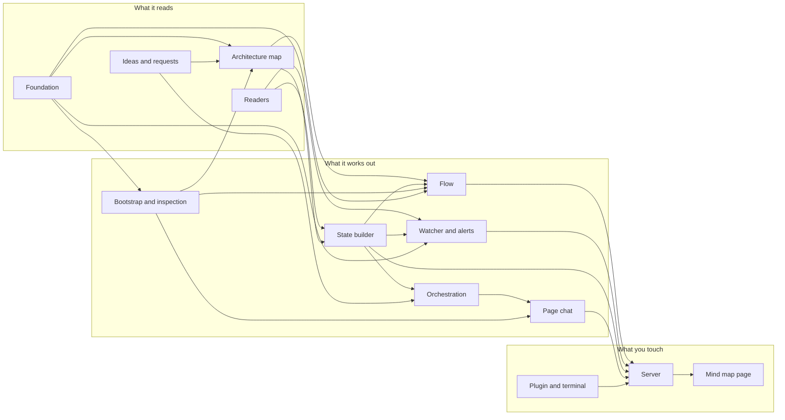

# session-map, part by part

The plugin seen part by part, one file per part. Every part file ends with **What's missing**, the open work as a checklist; the session map reads these files and draws them as its own mind map.

## The map

## The parts

| Part | In one line |
|---|---|
| [Readers](readers.md) | Reads Claude Code's local files, git and the config. |
| [Architecture map](architecture-map.md) | Reads a project's architecture folder; chats write it. |
| [Foundation](foundation.md) | Exact facts from the code, counted letter by letter, that everything else is checked against. |
| [Ideas and requests](ideas.md) | Every request of the owner, in his words, with where it went and where it stands. |
| [State builder](state-builder.md) | Joins everything into one state, with the AI's help. |
| [Page chat](page-chat.md) | Starts and drives Claude chats from the page. |
| [Flow](flow.md) | The diagram of how the parts talk, kept in step with the architecture. |
| [Orchestration](orchestration.md) | A senior conductor chat per project that hands work to activity chats. |
| [Watcher and alerts](watcher-and-alerts.md) | Watches every session and tells you what needs you, and why. |
| [Bootstrap and inspection](bootstrap-and-inspection.md) | Builds the map of a repository that has none and inspects it down to the comma. |
| [Server](server.md) | The local HTTP server, its token and its actions. |
| [Mind map page](mind-map-page.md) | The browser page. |
| [Plugin and terminal](plugin-and-terminal.md) | Commands, skills, hook and the text view. |

## How to keep this true

When someone asks for something new, add it as an item under "What's missing" of the right part before starting; mark it in progress when it starts and tick it when it is done. Every request the owner makes is also recorded in [Ideas and requests](ideas.md), pointing to the item it became. The `architecture` skill teaches this to every chat.
