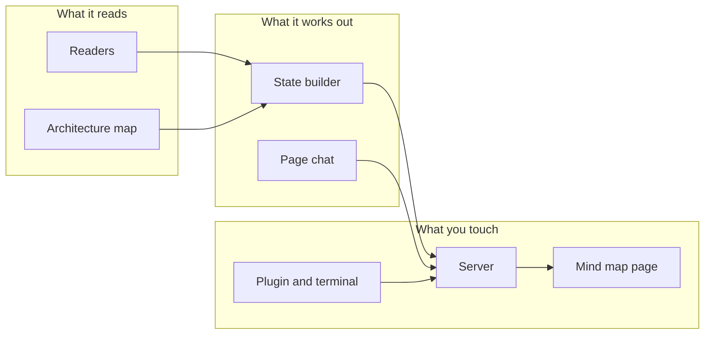

# session-map, part by part

The plugin seen part by part, one file per part. Every part file ends with **What's missing**, the open work as a checklist; the session map reads these files and draws them as its own mind map.

## The map

## The parts

| Part | In one line |
|---|---|
| [Readers](readers.md) | Reads Claude Code's local files, git and the config. |
| [Architecture map](architecture-map.md) | Reads and writes a project's architecture folder. |
| [State builder](state-builder.md) | Joins everything into one state, with the AI's help. |
| [Page chat](page-chat.md) | Starts and drives Claude chats from the page. |
| [Server](server.md) | The local HTTP server, its token and its actions. |
| [Mind map page](mind-map-page.md) | The browser page. |
| [Plugin and terminal](plugin-and-terminal.md) | Commands, skills, hook and the text view. |

## How to keep this true

When someone asks for something new, add it as an item under "What's missing" of the right part before starting; mark it in progress when it starts and tick it when it is done. The `architecture` skill teaches this to every chat.
