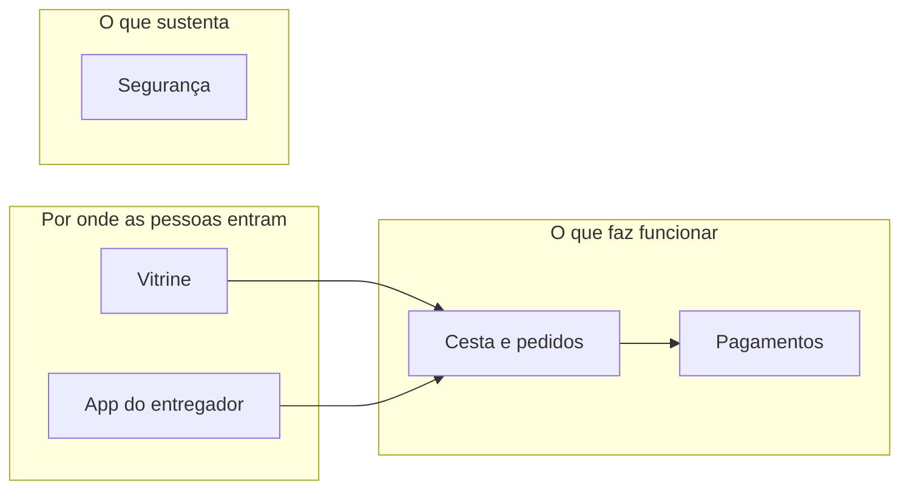

# As partes da Feira Digital

> **Versão:** 1.0
> **Tipo:** documento constitucional.

A Feira Digital vista pelas partes do produto, um arquivo por parte. Cada arquivo termina com a seção **"O que falta"**.

## O mapa

## As partes

| Parte                              | Em uma linha                                  |
| ---------------------------------- | --------------------------------------------- |
| [Vitrine](vitrine.md)              | O site onde o cliente escolhe os produtos.    |
| [App do entregador](app-do-entregador.md) | Rotas e entregas do dia.               |
